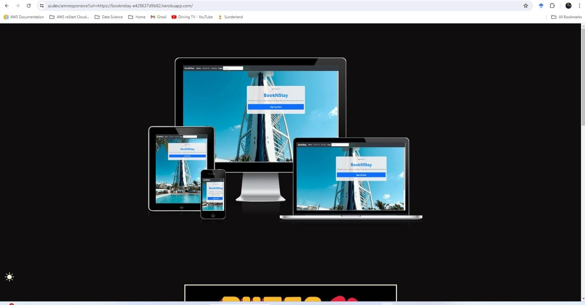
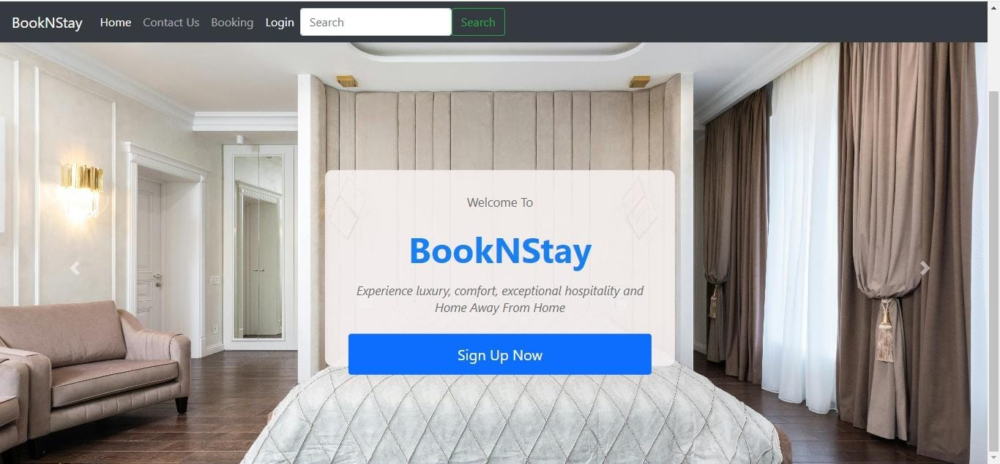

BookNStay 

BookNStay is a hotel booking project that is a Full Stack website built using Django framework. This booking website is built to enable guest and users to look for a hotel room online and make booking with respect to their choice. Users are required to register in order to make booking. When a user registered a user profile will be generated and user can update profile biography and profile image. Users can put their reviews on the booking they made and manage their own booking details. In addition users can create, update or edit and delete their own room booking.

The live application can be viewed here : 

https://booknstay-e428637d9b82.herokuapp.com/

## Purpose and Target Audience:

*Problem Statement:* Travelers face difficulties in knowing the availability of rooms across various hotels before making a trip. Additionally, they have no effective way to communicate their booking preferences or receive updates on their reservations.

*Purpose:* This hotel booking system will provide a detailed list of available rooms and their statuses. Users will be able to book, modify, and cancel their reservations easily, ensuring the application remains up-to-date and user-friendly.

*Target Audience:* This system is designed for frequent travelers who need reliable hotel booking options and for individuals seeking a streamlined and community-driven platform to share their experiences and preferences with fellow travelers.

#Personal and User Stories:

Henry is a passionate traveler who loves exploring new places and experiencing different cultures. She spends most of her free time planning her next adventure and is always on the lookout for the best hotels to stay in. He often travels to new cities and would like to view available hotel rooms and amenities before making a reservation.

## User Stories:

* As a guest, I want to be able to browse the available hotel rooms before booking, so I can choose the best option for my stay.

* As a user, I want to be able to add a booking with all relevant details, so other users can see the latest available rooms and services.

* As a user, I want to be able to create an account, so I can view available rooms and detailed booking information.

* As a guest, I want to be able to browse the available hotel rooms before booking, so I can choose the best option for my stay.

* As a user, I want to be able to edit and delete my bookings, so my information remains accurate and up-to-date.

* As a user, I want to explore new hotels and room options, so I can discover the best places to stay.

* As a user, I want to be able to read more information about a room and hotel, so I can ensure it meets my needs and preferences.

* As an admin, I want to be able to moderate user bookings and reviews, so I can ensure the information is appropriate and helpful for all users.

## Wireframe & Initial Design:

## Website-Structure-Design

## Features:

### Home Page:

#### Navbar & Hero Image:
The Navigation menu is made up of the follow tabs:Home, About, Rooms, Bookings, Profile, Reviews, Register and Login tabs.

The navigation menu serves as a navigational tool that allows users to access different sections, pages, or features of the website. Here are some key points about navigation menus:

*Home - Visible to all

*About - Visible to all

*Rooms - Visible to all

           - Manage Bookings - accessible by logged in users

           -Create Booking - accessible by logged in users

*Booking (Drop Down):

                -Make Bookings - accessible by logged in users

                -Manage Booking - accessible by logged in users

*Login - Visible to logged out users

*Register - Visible to logged out users

*Logout - Visible to logged in users

The navigation menu is displayed on all pages and they adapt to different screen sizes and devices. This will provide users with a structured and organized way to move around a website. It helps users find and access the content or functionality they are looking for.

Welcome to BookNStay, your ultimate hotel booking platform! Our landing page introduces you to our website and features a call-to-action button encouraging new guests and users to sign up. By signing up and logging in, you'll gain access to view available rooms and manage your bookings seamlessly.

Our intuitive navigation bar provides quick and easy access to essential sections of the website, including Home, Rooms, Add a Booking, Register/Logout, and Sign In. The hero image, showcasing stunning hotel destinations, enhances the aesthetic appeal and reflects our commitment to providing top-notch accommodations worldwide.

#### Registration:

Registration on BookNStay allows users to view available rooms and detailed booking information. It also enables them to add, edit, and delete their bookings, ensuring the hotel listings are always up-to-date and accurate. Sign up now to manage your reservations effortlessly and enjoy a seamless booking experience! 

#### Log In:

#### Rooms:

BookNStay Hotel offers a diverse range of accommodations to meet the unique needs and preferences of every guest. Each room is designed with comfort, luxury, and convenience in mind, ensuring a pleasant and memorable stay.

Whether you're traveling solo, as a couple, or with family, our rooms provide a cozy and comfortable environment with essential amenities. For those seeking extra space and enhanced features, our upgraded options offer additional comforts and luxurious decor.

Business travelers will find our accommodations well-suited to their needs, with dedicated workspaces and high-speed internet to ensure productivity and relaxation. For guests desiring the ultimate in luxury, our premium options deliver expansive living spaces, premium furnishings, and exclusive services for an extraordinary experience.

At BookNStay Hotel, we are committed to providing a comfortable, enjoyable, and tailored experience for all our guests.

# Room categories:
The Room Details page on BookNStay allows users to find more information about the room they are interested in. The room details include the room type, amenities, price per night, and a brief description, along with an image of the room. This provides users with sufficient information to make an informed decision about their stay.

At BookNStay Hotel, we offer a diverse range of rooms to cater to every guest's needs and preferences. Our accommodations are designed to provide comfort, luxury, and convenience, ensuring a memorable stay with a feeling of home away from home.

*Single Room:* Perfect for solo travelers, our Single Rooms offer a cozy and comfortable space equipped with all essential amenities. Ideal for business trips or short stays.

*King Room:* Spacious and elegantly furnished, our King Rooms feature a large king-sized bed, providing ample space for relaxation and a restful night's sleep.

*Queen Room:* Our Queen Rooms offer a blend of comfort and style with a plush queen-sized bed. These rooms are perfect for couples or individuals seeking a bit more space.

*Deluxe Room:* The Deluxe Rooms provide an upgraded experience with additional space, enhanced amenities, and luxurious decor. Perfect for guests looking for a premium stay.

*Executive Room:* Designed for business travelers, our Executive Rooms offer a sophisticated environment with a work desk, high-speed internet, and other business-friendly amenities, ensuring productivity and relaxation.

*Presidential Room:* The epitome of luxury, our Presidential Rooms offer unparalleled comfort and elegance. These rooms feature expansive living spaces, premium furnishings, and exclusive services, providing an extraordinary stay for our most discerning guests.

No matter which room you choose, BookNStay Hotel guarantees a comfortable and enjoyable experience tailored to your specific needs.

#### Create booking page:

A booking page for users was designed with a form that enables the user to enter details for booking enables the user to easily make a booking through the UI.

Some booking validation criteria was applied to the form to ensure that there there is no overlapping booking made by different users on the same room. If the room is booked by other customer the form alerts the user that booking is not available on the given date.

### Manage bookings page

A manage bookings page was add in order for user to have access of bookings made previously. Login validation is required for the user in order to have access on their own bookings. If the user is validated then the user will be redirected to the bookings list to view their scheduled bookings.

Edit Booking Page

On the 'Manage Bookings' page, you'll find an 'Edit' button that directs users to a form, enabling them to update their booking as needed. This convenient feature empowers users to effortlessly oversee and modify their own reservations.

### Search box

A "search box" is a graphical user interface (GUI) element was implemented to allow users to input specific keywords, phrases, or queries to search for rooms within the hotel. Search box facilitates information retrieval and navigation within the website, making it easier for users to find what they're looking for quickly and efficiently.

### Delete Booking

A delete button was added to the manage bookings page that will enable users to delete their booking.

<!-- #### Footer:

Links in the footer redirect to respective social media pages. 
It allows users to stay connected with the The Book Booth on social media platforms, keeping them informed about any changes that may occur over time. -->

### Error Pages

## 404 Page

a "404 Error Page" or simply an "Error 404 Page," is displayed to a user when they try to access a URL (Uniform Resource Locator) on a website, but the server cannot find the requested page. The "404" status code is part of the HTTP protocol, indicating that the requested resource (web page) does not exist.

The custom 404 page will allow the user to easily navigate back to the main page if they direct to a broken link / missing page, with custom link that directs the user to home page.

### 500 Page

A 500 error page has been displayed to alert users when an internal server error occurs. The message relays to users that the problem is on our end, not theirs.

# Future Features:

* Payment option

* Rewiews

# Features Left to implement.

*Gallery of the rooms to the home page, showing the different rooms.

### User Experience - Design

## Agile Methodology:
This project was developed using Agile principles and managed through a GitHub project board. As an individual developer implementing Agile for the first time, I found that creating user stories and identifying acceptance criteria provided a clear roadmap for targeting the various features and functionalities of the BookNStay hotel booking system. This approach helped me stay focused and minimized distractions.

### Database-Design
The application's database is composed of several distinct tables, each serving a specific purpose. These tables include Room, Booking, Category, User, and Auth-User. Together, they empower users to seamlessly carry out CRUD (Create, Read, Update, Delete) operations through an intuitive web-based user interface.

Of these tables, the User database takes center stage, serving as the primary table within the application. It establishes vital connections with other tables through foreign key relationships, enhancing the overall functionality and cohesion of the system.

Within the database, bookings are intricately linked to customers (users) through a Foreign Key relationship. This connection empowers users with the capability to seamlessly access, view, and update bookings associated with their individual accounts.

This functionality not only enhances user experience but also ensures that customers have full control and visibility over their reservations. It provides a convenient means to make changes, check booking details, and manage their bookings efficiently, contributing to a user-centric approach within the application.

Entity Relationship Diagrams (ERD) help the developer to make connections between databases and information. Creating an ERD helped me understand how the tables relate to one another. I used db diagram to create the diagram and the arrow represent how the data fields relate to one another.

## Security
Views were secured by using the django class based view mixin, UserPassesTextMixin. A test function was created to use the mixin and checks were ran to ensure that the user who is trying to access the page is authorized. Any staff restricted functionality, user edit/delete functionality listed in the features was secured using this method.

Environment variables were stored in an env.py for local development for security purposes to ensure no secret keys, api keys or sensitive information was added the the repository. In production, these variables were added to the heroku config vars within the project.

Users / guest gets authenticated when they login, logout or delete their profile.

### Technologies
*Python*
  *Python is the programming language applied to design this application.

*JavaScript*
  *JavaScript was utilized to create a custom modal on the profile page, to integrate the Bootstrap, further enriching the website's interactivity.

*Visual Studio Code and Gitpod*
 *Visual Studio Code and Gitpod IDE tool was utilized in building the website.

*HTML*
 *The primary language utilized in constructing the Website's structure was HTML.

*CSS*
  *The styling of the Website was designed by utilizing an separate CSS file.

*Bootstrap*
  *Bootstrap used as the front-end CSS framework for modern responsiveness and pre-built components.

*ElephantSQL*
  ElephantSQL used as the Postgres database.

*Heroku*

Heroku used for hosting the deployed back-end site.

*Git*
  *The source code of the Website was regularly committed and pushed during its development using Git.

*GitHub*
  *The source code of the website is accessible on GitHub, and it has been uploaded using Git Pages.

*Font Awesome*
The social media links in the footer section were adorned with icons obtained from https://fontawesome.com/.

### Python Modules

*Django Class-Based Views (ListView, UpdateView, DeleteView, CreateView): These classes were utilized to streamline the creation, reading, updating, and deletion of content in the application, simplifying the view logic and promoting code reusability.

*Mixins (LoginRequiredMixin, UserPassesTestMixin): Mixins such as LoginRequiredMixin and UserPassesTestMixin were employed to enforce essential features like requiring user authentication before accessing specific views and verifying whether a user is authorized to perform certain actions within the application.

*Messages: The 'messages' framework in Django was harnessed to provide informative and user-friendly feedback to site visitors. It facilitated the display of toasts and notifications to communicate actions' outcomes effectively.

# Design Choices:

## Colour scheme:

Dark - Header

#fafafa  - Buttons

Dark - Footer

The colours were selected with the intention of complementing the hero image and the idea was to ensure the image was appreciated.

## Typography:
 Consistency in typography enhances the website's overall aesthetic and readability. To achieve this, the website employs the modern and versatile Roboto font for the body text, ensuring a clean and legible reading experience for users.

For titles and headings, the elegant Font awesome, sourced from Google Fonts, is employed. This distinctive typeface adds a touch of sophistication and visual impact to key elements across the website.

### Imagery
The website's images were sourced from Pexels and Unsplash, both reputable platforms offering a wide selection of royalty-free images. This choice ensures that the visuals used on the website not only enhance its aesthetic appeal but also adhere to legal and ethical standards regarding image usage.

## Testing 

In this section, you need to convince the assessor that you have conducted enough testing to legitimately believe that the site works well. Essentially, in this part you will want to go over all of your project’s features and ensure that they all work as intended, with the project providing an easy and straightforward way for the users to achieve their goals.

In addition, you should mention in this section how your project looks and works on different browsers and screen sizes.

You should also mention in this section any interesting bugs or problems you discovered during your testing, even if you haven't addressed them yet.

If this section grows too long, you may want to split it off into a separate file and link to it from here.

### Lighthouse Audit:
I've tested my deployed project using the Lighthouse Audit tool to check for any major issues.

*On a laptop, ipad, phone:*
Home

### Validator Testing 

- HTML
  - No errors were returned when passing through the official 
  
  

  

  

- CSS
  - No errors were found when passing through the official 
  [(Jigsaw) validator](../BookNStay/hotel/static/hotel/images/BookNStayCSSvalidation.jpeg)

  ### Cross Browser Compatibility Testing
  I ensured compatibility with Chrome, Opera, Microsoft Edge, and Firefox desktop browsers and verified responsiveness using Chrome Developer Tools across various devices including:

  - Desktop
  - Laptop
  - Moto G4
  - Galaxy S5
  - iPhone 5/SE, iPhone 6/7/8, iPhone 6/7/8 Plus
  - iPad, iPad Pro
  - Galaxy Fold

### Unfixed Bugs

You will need to mention unfixed bugs and why they were not fixed. This section should include shortcomings of the frameworks or technologies used. Although time can be a big variable to consider, paucity of time and difficulty understanding implementation is not a valid reason to leave bugs unfixed. 

### Repository
The website was developed using the Visual Studio code and gitpod editor and uploaded to the remote repository named 'BookNStay' on GitHub.

During the development process, the following Git commands were utilized to push the code to the remote repository:

 *git add [file] command was utilized to include the file(s) in the staging area prior to committing them.
  *git commit -m [commit message] command was employed to record and save the changes made to the local repository, preparing them for the final step.
  *git push command was utilized to upload all committed code to the remote repository on GitHub. 

### Hosting on Heroku
 *The website was successfully published on Heroku applications. The deployment process involved the following steps:
 *Open Heroku website and click "New" to create a new app.
 *Create an app name and region region, click "Create app".
 *Click "Settings" and click Config Vars. Add the following config variables:
 *KEY: PORT
 *VALUE: 8000
 *SECRET_KEY: (Your secret key)
 *DATABASE_URL: (This include the database)
 *CLOUDINARY_URL: (This include the cloudinary storage url)
 *Select Buildpacks and add buildpacks for Python and NodeJS (in that order).
 *Click to "Deploy". Select the deployment type to Github and enter repository name and connect.
 *At the bottom of the page go to Manual Deploy, select "main" branch and select "Deploy Branch".
 *Once completed successfully, after waiting for some time the app will be deployed to heroku.

### Clone the repository code locally
 To create a local copy of the repository code by cloning it just do the following steos:

 *Navigate to the GitHub Repository that you want to clone locally, and then click on the dropdown button labeled "Code".
 *Click on "HTTPS" and copy the link.
 *Open your IDE and install git.
 *On your cmd line write git clone "your https link".

### Credits
 *The Room and Living room Images was taken from pexels.

 *The Logo Images was taken from LOGO.com

 *A special thanks to Chibueze Igwe, Ernest Dapaah, Ikenna Egwin, and all the students in our cohort for their continuous help and support throughout the course.

 *Font Awesome was used for icons and the fonts used were derived from Google Fonts.

 *Code institute django blog and other resources provided on the LMS.

 *Wireframes were design by Balsamiq Wireframes

 *Other past projects especially from https://github.com/hiboibrahim/thebookbooth1 and https://github.com/bky201/HotelBooking

 *Code Institute for Full stack development online classe, our facilitators, Iris Smok, Kevin, Martin, David and others.
